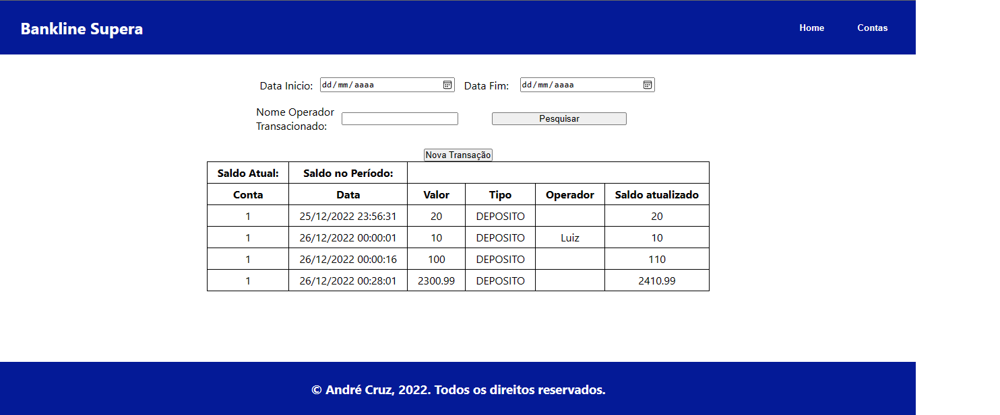
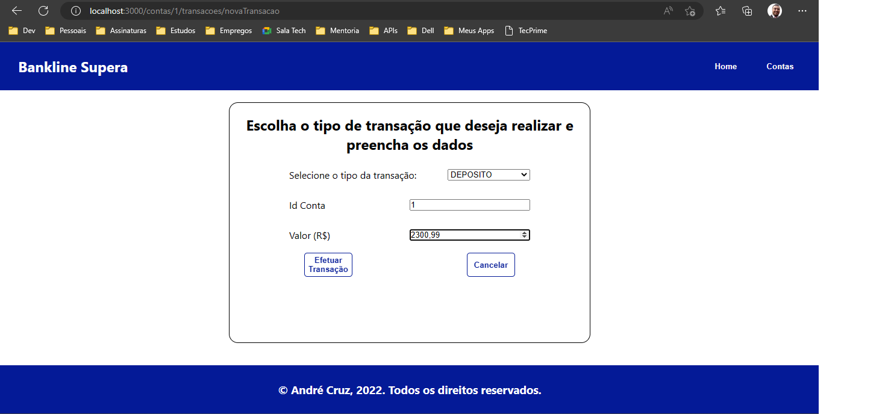

# Desafio de projeto Supera - Front-end

#### Bem-Vindo! 👋

## Objetivo

Consumir uma API REST no contexto de uma instituição financeira, criando a interface gráfica para interação com usuários.

## Índice:

  - [Visão Geral](#visao-geral)
  - [Screenshots](#screenshots)
  - [Tecnologias](#tecnologias)
  - [Aprendizado](#aprendizado)
  - [Autor](#autor)

# Visão Geral

Basicamente, o usuário pode consultar seu saldo e realizar um depósito, saque ou transferência.

### Screenshots

##### Consultando o Extrato  

##### Realizando uma transferência  

## Tecnologias

- React
- React Router DOM 6
- Fetch API

## Aprendizado

- Manipulação de estados do componente com useState
- Lifecycle Hooks
- Async / Await
- React Router DOM para navegação entre páginas SPA
- Consumo de API REST com Fetch API

## Autor

- GitHub - [André Cruz](https://github.com/andreldcm989)
- LinkedIn - [André Cruz](https://www.linkedin.com/in/andreldcruz/)
